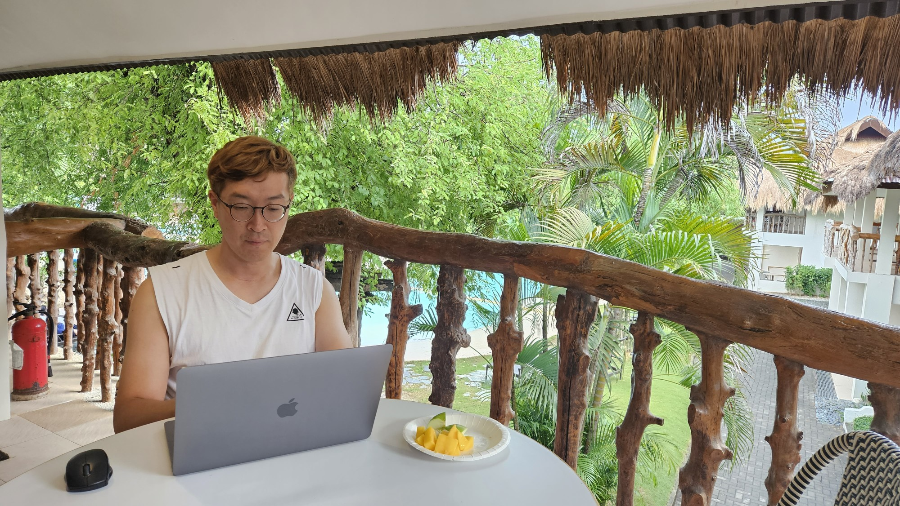

# Cremazer's Github Blog

이 블로그는 프로그램 개발과 관련된 기술적인 내용을 정리하는 개인 블로그입니다.

This blog is a personal blog that organizes technical content related to program development.

## Category

[Posts by Category](https://cremazer.github.io/categories/)

## Questions?

질문은 [Contact](https://cremazer.github.io/contact/) 화면을 통해 메시지를 보내주시거나, 이메일(cremazer@gmail.com)로 문의바랍니다.

For questions, please send a message via the [Contact](https://cremazer.github.io/contact/) screen or email us at cremazer@gmail.com.

## Donation

Did you like my blog? Buy me a beer :)

## Author

[Cremazer](https://cremazer.github.io/about/) based on [Jekyll Template](https://github.com/thiagorossener/jekflix-template).

## License

*Cremazer's Github Blog* is available under the MIT license. See the LICENSE file for more info.
